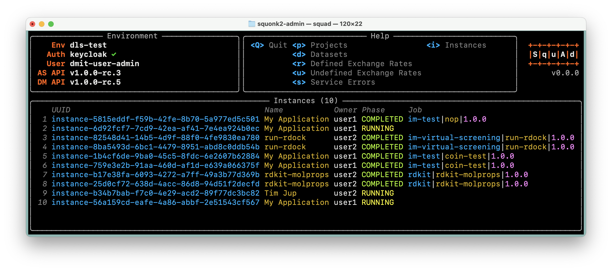

#############
Squonk2 Admin
#############

**SquAd** (Squonk2 Administration) is s Textual-UI (TUI) for the
visualisation and administration of Squonk2 environments. **SquAd** is
designed to be used by those with Squonk2 administrative privileges,
it's of little use to users who are not administrators.

**SquAd** uses the `squonk2-python-client`_ to interact with a Squonk2 environment
and uses Will McGugan's `textual`_ framework to provide the user with a simple,
text-based user interface modelled on the popular `k9s`_ Kubernetes monitor.

**SquAd** is *NOT* an alternative to (or replacement for) the existing
`Data Manager UI`_. The role of **SquAd** is to provide a simple and lightweight
Data Manager (and Account Server) *monitor*, providing administrator-only
features not available in the UI.

.. _data manager ui: https://github.com/InformaticsMatters/mini-apps-data-tier-ui
.. _k9s: https://k9scli.io
.. _squonk2-python-client: https://github.com/InformaticsMatters/squonk2-python-client
.. _textual: https://github.com/Textualize/textual

************
Installation
************

**SquAd** is a Python application, written with Python 3.10 and published
to `PyPI`_ and is easily installed using ``pip``::

    pip install im-squonk2-admin

.. _pypi: https://pypi.org/project/im-squonk2-admin/

*********
Execution
*********

Before running **SquAd** you must have access to a Squonk2 environment.
**SquAd** obtains details of the environment through a YAML-based
*environments* file. An example file, ``environments``, is located in the root
of this project:

    .. include:: environments
       :code: yaml

When **SquAd** starts it will look for the environments file in your home
directory, in the file ``~/.squad/environments``. If you place your populated
environments file there you need do nothing else prior to running **SquAd**.
If you prefer to put your ``environments`` file elsewhere, or have multiple
files, set the path to your file using the environment variable
``SQUAD_ENVIRONMENT_FILE``::

    export SQUAD_ENVIRONMENT_FILE=~/my-squad-environments

With an environments file in place you can run **SquAd**::

    squad

Logging
-------

You can enable logging from **SquAd** and the underlying textual framework by
setting the environment variable ``SQUAD_LOGFILE`` when running the
application::

    SQUAD_LOGFILE=./squad.log squad
